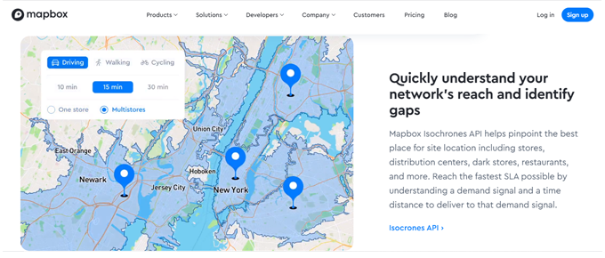

<div align="center">
  <p align="center">
    
  </p>
 <h1>MAPBOX Maps</h1>
 <h3>Desenvolvendo mapas com Mapbox<h3>
</div>

1. Crie o projeto React Typescript
```bash
$ npx create-react-app react-ts-mapbox --template=typescript
```

2. Crie a chave api em: https://www.mapbox.com/

3. Instale o pacote Mapbox
```bash
$ yarn add react-mapbox-gl mapbox-gl
```